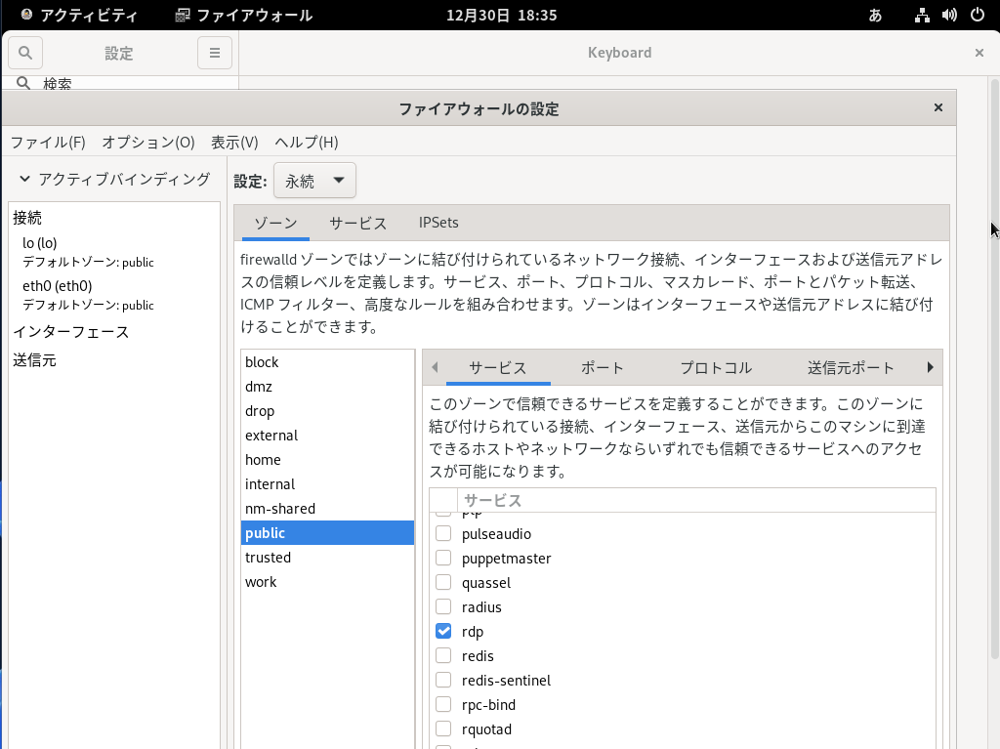

# oracle_linux
Oracle Linux での各種マニュアル

## OSインストール

- https://yum.oracle.com/oracle-linux-isos.html
  - https://yum.oracle.com/ISOS/OracleLinux/OL9/u3/x86_64/OracleLinux-R9-U3-x86_64-dvd.iso

- VirtualBoxでの構築
  - 

## 初期設定

1. 最初の諸々の設定
  ```
  $ sudo dnf -y install oracle-epel-release-el9
  $ sudo dnf -y install firewall-config
  $ sudo dnf -y install git
  $ git config --global user.email "kuhataku@gmail.com"
  $ git config --global user.name "kuhataku"
  $ sudo grubby --update-kernel ALL --args selinux=0
  $ sudo reboot
  ```

2. 日本語入力（再起動が必要）
  - 

3. リモートデスクトップ接続設定
  ```
  $ sudo dnf -y install xrdp tigervnc-server
  $ sudo systemctl start xrdp
  $ sudo systemctl enable xrdp
  $ sudo reboot
  ```
  - 

## Oracle Database インストール

[オラクル・データベース・ソフトウェアのダウンロード](https://www.oracle.com/jp/database/technologies/oracle-database-software-downloads.html#db_ee)

```
$ sudo dnf -y install oracle-database-preinstall-19c
$ passwd oracle
$ sudo dnf -y localinstall ./ダウンロード/oracle-database-ee-19c-1.0-1.x86_64.rpm 
$ sudo su -
# /etc/init.d/oracledb_ORCLCDB-19c configure

# vi /etc/bashrc 
# source /etc/bashrc 

# 設定内容
umask 022
export ORACLE_BASE=/opt/oracle
export ORACLE_HOME=/opt/oracle/product/19c/dbhome_1
export PATH=$PATH:$ORACLE_HOME/bin
export ORACLE_SID=ORCLCDB
export NLS_LANG=Japanese_Japan.AL32UTF8

$ sqlplus / as sysdba
SQL> STARTUP

# パスワード変更
SQL> alter user sys identified by oracle;
SQL> alter user system identified by oracle;
```

## Oracle Database Client インストール（クライアントだけ必要な場合）

```
$ sudo dnf -y install oracle-instantclient-release-el9
```